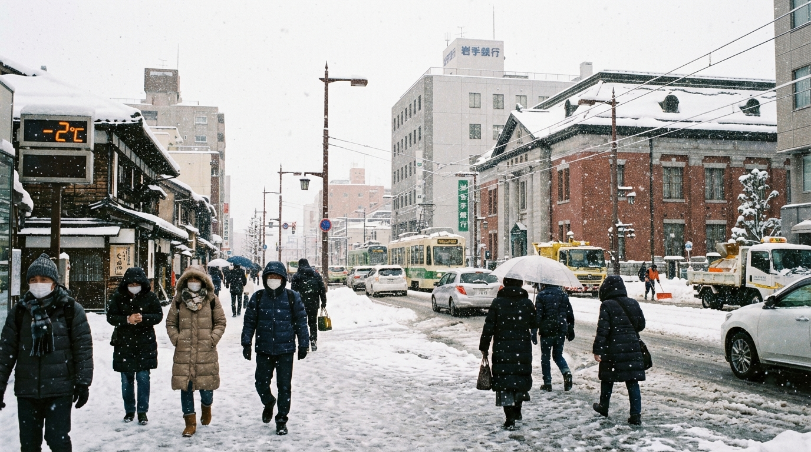

# 盛岡市の天気画像生成

## 生成された画像



## 天気情報（2024年12月22日）

- **場所**: 盛岡市
- **気温**: 約-2°C（現在）
- **最高気温**: 約0-1°C
- **最低気温**: 約-4~-3°C
- **天気**: 雪または曇り
- **風**: 北風、時々強い風
- **体感温度**: 約-8°C前後
- **降水確率**: 40-60%

## 生成に使用したプロンプト

```
盛岡市の冬景色、雪が降る寒い日、気温-2°C、日本の街並み、空には雪雲、人々は暖かいコートを着ている、リアルな天気情景
```

## 生成設定

- **モデル**: Nano Banana Pro (Gemini 2.5 Flash Image model)
- **画像サイズ**: 1376 x 768 ピクセル (16:9比率)
- **フォーマット**: PNG
- **生成ツール**: MCPサーバー t2i-kamui-fal-nano-banana-pro

## 使用したMCPサーバー

```json
{
  "mcpServers": {
    "t2i-kamui-fal-nano-banana-pro": {
      "type": "http",
      "url": "https://kamui-code.ai/t2i/fal/nano-banana-pro",
      "headers": {
        "KAMUI-CODE-PASS": "kamui-pass-2025-7568"
      }
    }
  }
}
```

## 生成プロセス

1. 盛岡市の現在の天気情報をウェブ検索で取得
2. 天気情報を基に日本語のプロンプトを作成
3. MCPサーバー経由でNano Banana Proモデルを使用して画像を生成
4. 生成された画像をローカルに保存

## 注意事項

- 道路が凍結する可能性あり
- 暖かい服装が必要
- 雪道運転に注意